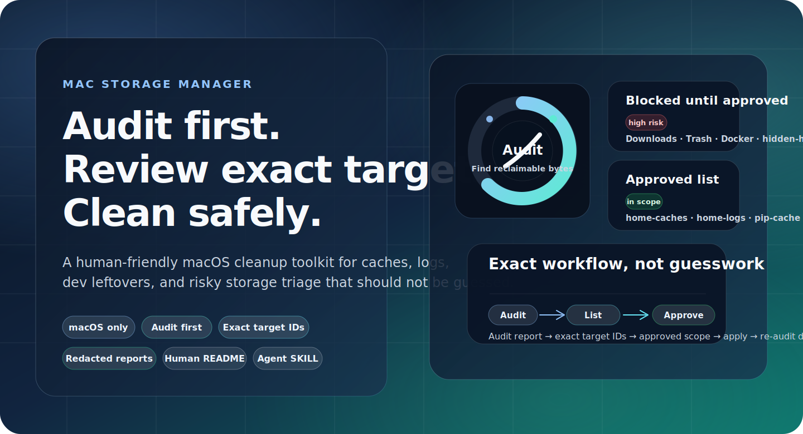
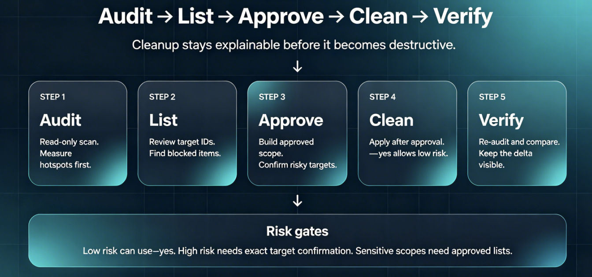

<p align="center">
  
</p>

<p align="center">
  <a href="#一眼看懂">一眼看懂</a> · <a href="#工作链路">工作链路</a> · <a href="#快速开始">快速开始</a> · <a href="#常见问题">FAQ</a>
</p>

<h1 align="center">Mac Storage Manager</h1>

<p align="center">
  给人类看的 macOS 安全清理工具包：先审计，先列清单，确认后才清理。<br>
  A human-friendly macOS cleanup toolkit: audit first, list exact targets, clean only after approval.
</p>

<p align="center">
  适合清缓存、日志、开发工具残留；不适合“闭着眼一键全删”。<br>
  Great for caches, logs, and dev leftovers; not for blind one-click deletion.
</p>

<p align="center">
  <code>macOS only</code> · <code>Audit first</code> · <code>Exact target IDs</code> · <code>Redacted reports</code>
</p>

## 近期更新
## Recent Notes

**最新更新 / Latest note**

- 更新时间：2026-05-05 16:21  
  Update time: 2026-05-05 16:21
- 更新内容：继续精修 GitHub 首屏视觉，补了快速导航与“适合 / 不适合”信息块，让人类读者更快判断这个仓库该怎么用。  
  Update content: Further refined the GitHub first screen with quick navigation plus a fit-vs-not-fit panel so human readers can decide faster how to use the repo.

**最近一条 / One recent note**

- 更新时间：2026-04-24 01:18  
  Update time: 2026-04-24 01:18
- 更新内容：润色 README 的英文文案和双语排版。  
  Update content: Polished the README English copy and bilingual layout.

## 一眼看懂
## At a Glance

<table>
<tr>
<td width="25%" valign="top">
<strong>🧭 先审计</strong><br>
默认只读，不先动盘。<br>
<em>Read-only first. No surprise deletion.</em>
</td>
<td width="25%" valign="top">
<strong>🧾 先列精确目标</strong><br>
先看 target ID、blocked 项和范围外项目。<br>
<em>Review exact target IDs, blocked items, and out-of-scope items first.</em>
</td>
<td width="25%" valign="top">
<strong>🛡️ 再做确认</strong><br>
高风险项目必须精确确认。<br>
<em>High-risk cleanup needs explicit, exact confirmation.</em>
</td>
<td width="25%" valign="top">
<strong>🧼 最后清理</strong><br>
优先清缓存、日志和可重建残留。<br>
<em>Best at caches, logs, and regenerable leftovers.</em>
</td>
</tr>
</table>

<table>
<tr>
<td width="50%" valign="top">
<strong>✅ 更适合 / Best for</strong><br>
缓存、日志、开发工具残留、磁盘热点排查。<br>
<em>Caches, logs, dev-tool leftovers, and storage triage.</em>
</td>
<td width="50%" valign="top">
<strong>⛔ 不适合 / Not for</strong><br>
闭眼一键全删、替你决定高风险删除、跳过确认直接动敏感目录。<br>
<em>Blind one-click deletion, risky auto-decisions, or skipping approval on sensitive paths.</em>
</td>
</tr>
</table>

> **README 给人看；`SKILL.md` 给 agent 看。**  
> **This README is for humans; `SKILL.md` is for agents.**

## 结构总览
## Structure Map

- `README.md`  
  人类入口：解释这个仓库是什么、怎么开始、哪些边界最重要。  
  Human landing page: what this repo is, how to start, and which guardrails matter most.

- `SKILL.md`  
  agent 契约：告诉智能体什么时候触发这个 skill、如何审计、何时必须停下来等确认。  
  Agent contract: when the skill should trigger, how to audit, and when to stop for confirmation.

- `scripts/mac_storage_manager.py`  
  核心引擎：提供 `audit`、`plan`、`clean` 三种模式。  
  Core engine: implements the `audit`, `plan`, and `clean` modes.

- `scripts/audit_storage.sh`  
  只读 wrapper：快速输出 Markdown 审计报告。  
  Read-only wrapper: quickly emits a Markdown audit report.

- `scripts/safe_clean.sh`  
  执行 wrapper：走 `clean --apply --yes --markdown`，其中 `--yes` 只会放行低风险目标。  
  Execution wrapper: runs `clean --apply --yes --markdown`, where `--yes` only unlocks low-risk targets.

- `references/hidden-home-cleanup.md`  
  特殊情况说明：hidden-home、容器 UUID、owner mismatch 的处理边界。  
  Special-case rules: boundaries for hidden-home items, container UUIDs, and ownership mismatches.

- `tests/test_mac_storage_manager.py`  
  单元测试：覆盖路径脱敏、隐私处理、hidden-home 规则和 system roots。  
  Unit tests: cover path redaction, privacy handling, hidden-home rules, and system roots.

## 工作链路
## How It Works

<p align="center">
  
</p>

1. 跑 `audit` 看最大空间热点。  
   Run `audit` to see the biggest space hotspots.

2. 读取 exact target list，确认有哪些 `blocked` 项、哪些项目还在批准范围外。  
   Read the exact target list and check which items are `blocked` or still outside the approved scope.

3. 对高风险项目，用 `--approved-targets` 和 `--confirm-targets` 做精确授权。  
   For high-risk items, grant exact approval with `--approved-targets` and `--confirm-targets`.

4. 只在确认后执行 `clean --apply`；如果只是想预演，跑 `clean --dry-run` 或 `plan`。  
   Only run `clean --apply` after confirmation; if you just want a preview, run `clean --dry-run` or `plan`.

5. 重新审计，比较清理前后空间和剩余热点。  
   Re-run the audit and compare free space plus remaining hotspots.

> `safe_clean.sh` 更适合低风险批量清理；敏感项请直接调用 Python 入口并传 exact target IDs。  
> `safe_clean.sh` is best for low-risk cleanup; for sensitive targets, call the Python entrypoint directly and pass exact target IDs.

## 它会清什么
## What It Can Clean

- `~/Library/Caches`、`~/Library/Logs`  
  用户缓存和日志。  
  User caches and logs.

- Xcode 相关残留  
  `DerivedData`、`Archives`、`iOS DeviceSupport`，以及 `xcrun simctl delete unavailable`。  
  Xcode leftovers including `DerivedData`, `Archives`, `iOS DeviceSupport`, and `xcrun simctl delete unavailable`.

- 包管理器缓存  
  `npm`、`pnpm`、`pip`、`Gradle`、`CocoaPods`、Homebrew。  
  Package-manager caches for `npm`, `pnpm`, `pip`, `Gradle`, `CocoaPods`, and Homebrew.

- 开发工具缓存  
  Playwright、VS Code、JetBrains。  
  Dev-tool caches for Playwright, VS Code, and JetBrains.

- 定向目标  
  Flutter 工程残留、指定 app 的 leftovers、hidden-home 扫描、system roots 扫描。  
  Targeted cleanup for Flutter projects, app leftovers, hidden-home scans, and system-root scans.

> 某些目标依赖 `brew`、`docker`、`flutter` 或 `xcrun`；缺失时会自动跳过。  
> Some targets depend on `brew`, `docker`, `flutter`, or `xcrun`; they are skipped when the tool is unavailable.

## 默认不会碰什么
## What It Will Not Touch by Default

- `Downloads`  
  高风险；需要精确确认。  
  High risk; needs exact confirmation.

- `~/.Trash`  
  中风险；需要精确确认。  
  Medium risk; needs exact confirmation.

- Docker 大扫除  
  `docker system prune -f` 属于高风险并且不可恢复。  
  `docker system prune -f` is high risk and not recoverable.

- hidden-home 敏感目录  
  包括 `~/.git` 这类路径；必须先列清单，再给 approved target list。  
  Sensitive hidden-home paths, including `~/.git`; they require an exact approved target list first.

- system roots  
  默认不开启；需要 `--include-system`，而且必须给足四个 system roots。  
  Disabled by default; they require `--include-system` and a full set of four system roots.

- owner 不匹配的 npm cache  
  如果缓存里混进 root-owned 文件，系统会 block，而不是强行删除。  
  If an npm cache contains root-owned files, the cleanup is blocked instead of being force-deleted.

## 快速开始
## Quick Start

### 1) 先做只读审计
### 1) Start with a read-only audit

```bash
bash scripts/audit_storage.sh
```

### 2) 先预演，再决定
### 2) Preview before you decide

```bash
bash scripts/safe_clean.sh --dry-run
```

### 3) 只清低风险项
### 3) Apply low-risk cleanup only

```bash
bash scripts/safe_clean.sh
```

### 4) 对敏感项做精确授权
### 4) Approve sensitive targets exactly

```bash
python3 scripts/mac_storage_manager.py clean \
  --apply \
  --include-hidden-home \
  --approved-targets TARGET_ID \
  --confirm-targets TARGET_ID \
  --markdown
```

将 `TARGET_ID` 换成审计输出里的真实 target ID。  
Replace `TARGET_ID` with the real target ID returned by the audit output.

## 进阶用法
## Advanced Usage

### 友好入口
### Friendly Entry Points

```bash
bash scripts/audit_storage.sh
bash scripts/safe_clean.sh --dry-run
bash scripts/safe_clean.sh
```

### 定向扫描
### Targeted Scans

```bash
python3 scripts/mac_storage_manager.py audit --json
python3 scripts/mac_storage_manager.py audit --include-hidden-home --markdown
python3 scripts/mac_storage_manager.py audit --app-path "/Applications/Example.app" --markdown
python3 scripts/mac_storage_manager.py audit --include-system \
  --system-roots /Library,/private/var/db/receipts,/private/var/tmp,/tmp \
  --markdown
```

## 隐私与可移植性
## Privacy & Portability

- 审计报告默认把 `home`、`root` 和私有绝对路径脱敏。  
  Audit reports redact `home`, `root`, and private absolute paths by default.

- 容器 bundle ID 和 owner-mismatch path 在共享报告里会做敏感信息处理。  
  Container bundle IDs and owner-mismatch paths are redacted in shareable reports.

- 运行时不绑用户名、不绑机器名、不绑固定设备路径。  
  Runtime output does not hardcode usernames, machine names, or device-specific paths.

- `--system-roots` 和 `MAC_STORAGE_SYSTEM_ROOTS` 可以覆盖 system paths。  
  `--system-roots` and `MAC_STORAGE_SYSTEM_ROOTS` can override system paths.

- wrapper 脚本使用 `/usr/bin/env zsh` 提高兼容性。  
  Wrapper scripts use `/usr/bin/env zsh` for portability.

## 验证
## Validation

```bash
python3 -m unittest -v tests.test_mac_storage_manager
```

这个测试集目前覆盖：  
This test suite currently covers:

- 路径脱敏 / path redaction
- 敏感诊断脱敏 / sensitive-note redaction
- hidden-home 行为 / hidden-home behavior
- 自定义 system roots / custom system roots

## 常见问题
## FAQ

<details>
<summary><strong>它会不会直接清空 Downloads？ / Will it wipe Downloads automatically?</strong></summary>

不会。`Downloads` 是高风险目标，需要精确确认。  
No. `Downloads` is a high-risk target and requires exact confirmation.

</details>

<details>
<summary><strong>我能不能把审计报告直接发到群里？ / Can I share the audit report publicly?</strong></summary>

默认会做路径和部分敏感诊断脱敏，但发出去之前还是建议你再看一眼。  
Paths and some sensitive diagnostics are redacted by default, but you should still review the report before sharing it.

</details>

<details>
<summary><strong>如果 npm 缓存里混进 root-owned 文件怎么办？ / What if my npm cache contains root-owned files?</strong></summary>

正常清理会直接 block，避免误删；先修 owner，再决定要不要继续。  
Normal cleanup is blocked to avoid accidental deletion; fix the ownership first, then decide whether to continue.

</details>

## License
## License

MIT。  
MIT.

由 **AI·Maho** 和 **人类·Matoya** 共同维护
Maintained jointly by **AI·Maho** and **Human·Matoya**
